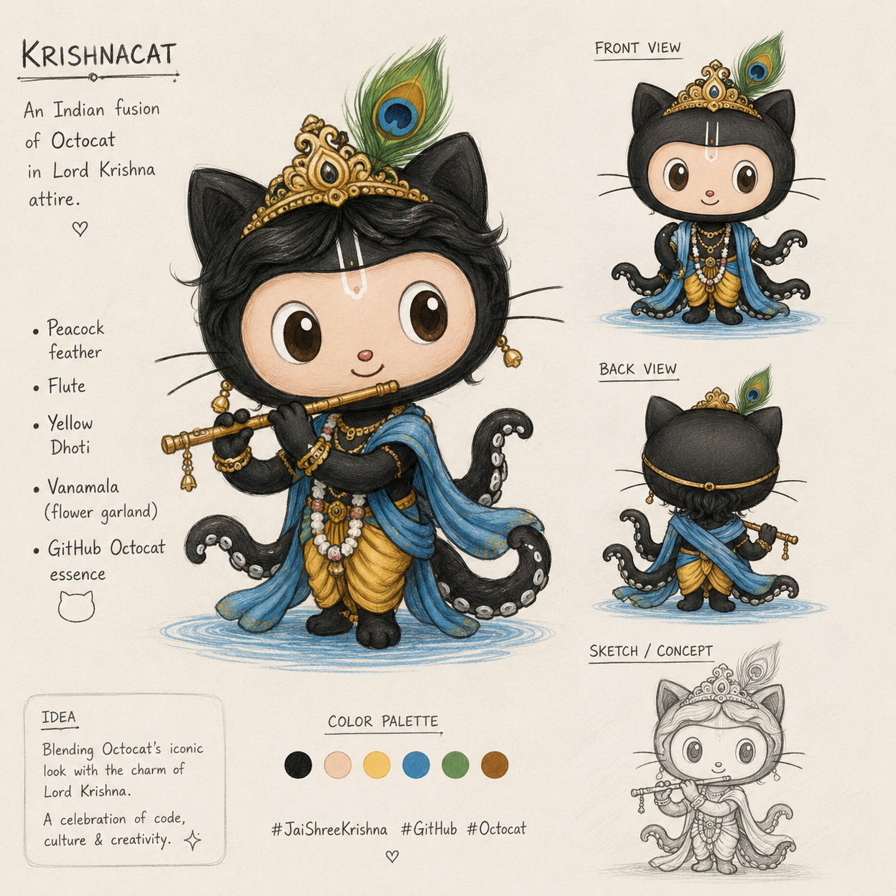
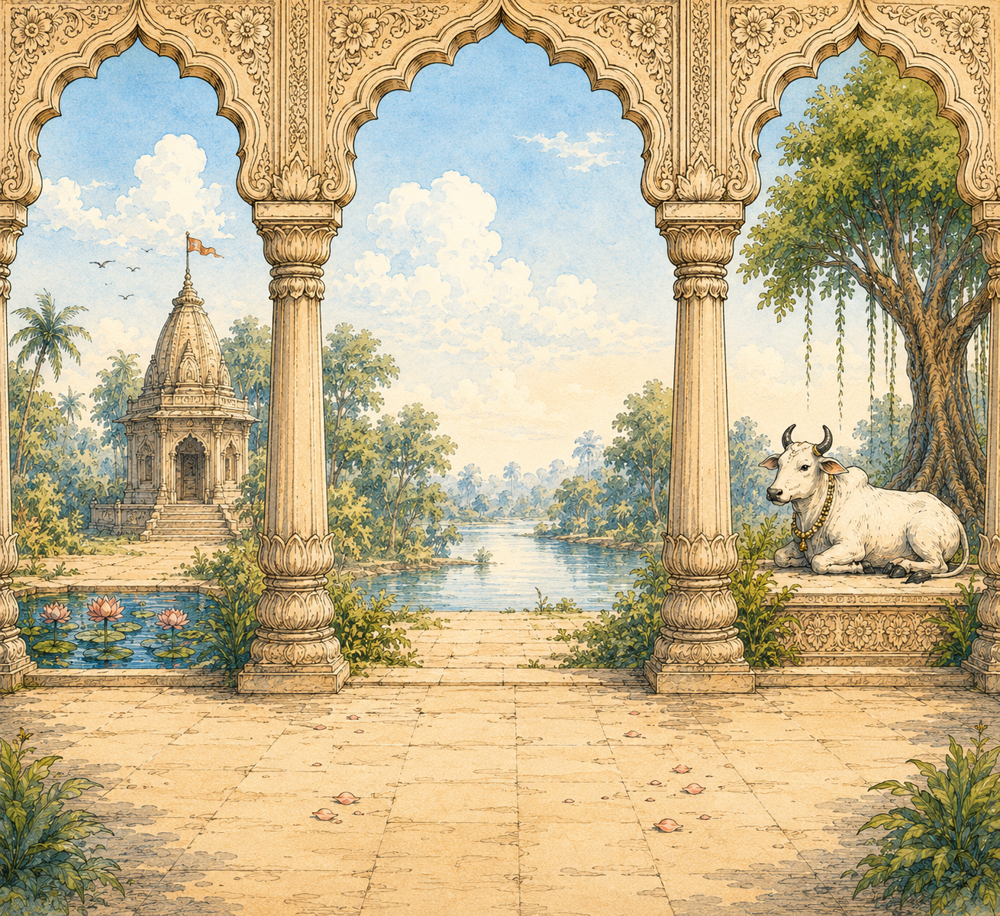

# 🦚 OctoKrishna: A Cultural Spin on a Tech Icon

.png)

## 📌 What is this?
This project is my submission for the **Major League Hacking (MLH) Global Hack Week: GenAI**. The challenge was to design a brand-new, original variant of the GitHub Octocat. 

I wanted to bring a piece of Indian heritage into the open-source universe, so I designed **OctoKrishna**—a blend of the traditional ink-black GitHub mascot with the aesthetic and iconography of Lord Krishna.

## ⚙️ The GenAI Workflow
This wasn't just a single prompt. The image is a composite of a structured GenAI workflow combining character design and environment generation.

### 1. Character Concept & Design
The goal was to keep the Octocat recognizable while adding traditional elements.
* **The Crown & Feather:** A golden crown topped with a peacock feather.
* **The Bansuri:** A golden flute for the Octocat to hold.
* **The Attire:** A yellow dhoti, blue sash, and a Vanamala (floral garland).

### 2. Environment Generation
The background was generated separately to create a specific "stage" for the character. I aimed for a peaceful, classic Indian temple aesthetic, complete with a sacred cow and a lotus pond.

## 🔗 Links & Full Breakdown
I put together a full, high-resolution presentation board breaking down the visual journey of this project. 

* 🎨 **View the full case study on Behance:** [https://www.behance.net/gallery/249179913/OctoKrishna-GitHub-Mascot-Concept-Art]
* 🤝 **Let's connect:** [https://www.linkedin.com/in/moksh-pahuja25/]

---
*Created for MLH Global Hack Week: GenAI | May 2026*
